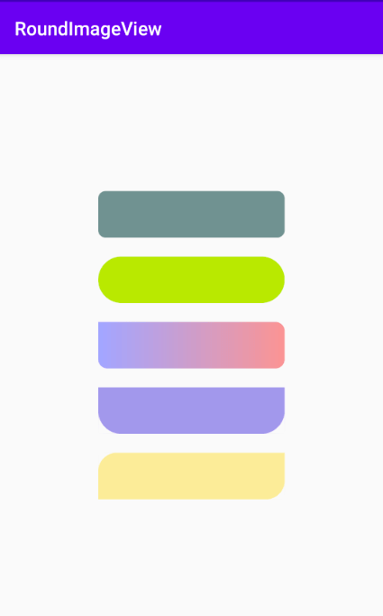

[](https://jitpack.io/#symeonchen/roundImageView)


# RoundImageView

This is an `ImageView` that implements rounded corners by overriding the `onDraw()` method.

## Screenshots


## Usage

### Step 0
Make sure your project support `Kotlin` and using `androidx` dependecies.
### Step 1
Add the `JitPack` repository to your build file.

```groovy
	allprojects {
		repositories {
			...
			maven { url 'https://jitpack.io' }
		}
	}
```
### Step 2
Add the dependency.

```groovy
	dependencies {
	        implementation 'com.github.symeonchen:roundImageView:latest'
	}
```

### Step 3
Use it like use `ImageView`.
```xml
    <com.symeonchen.roundimageview.RoundImageView
        android:id="@+id/riv_sample"
        android:layout_width="200dp"
        android:layout_height="50dp"
        android:src="#9F9CEA"
        app:corner_radius="25dp"
        app:top_end="false"
        app:top_start="false" />
```

# License
MIT License

Copyright (c) 2020 SymeonChen

